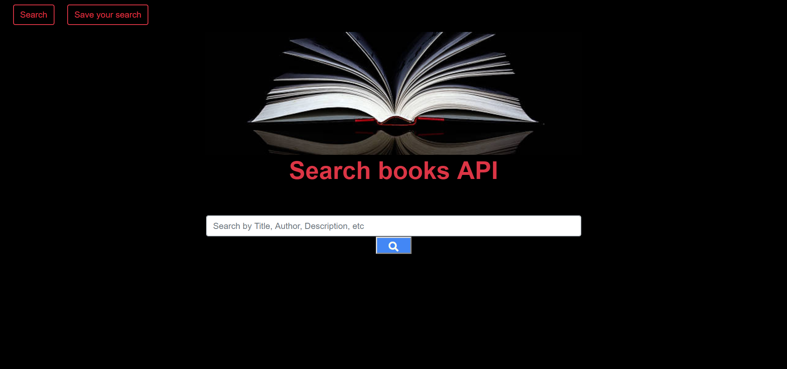

# google-books-react-search

URL: https://protected-chamber-72561.herokuapp.com

A MERN stack application, that will conect to the google books API. I will allow you to fetch data from it and also save it to a local mongo db data base.

To run download or clone the repo.

Note: Delete the package json that comes with the application to get the current npm packages with updated security.

In the command line, run:

npm init -y (to initialize updated npm packages)
npm i (to install packages)
You can view the app in heroku

### Technologies used:

-Node/Express JS
-React
-MongoDB

NPM Packages:
"axios": "^0.18.0",
"dotenv": "^6.2.0",
"express": "^4.16.3",
"if-env": "^1.0.4",
"mongodb": "^3.1.13",
"mongoose": "^5.4.14",
"concurrently": "^4.1.1"

